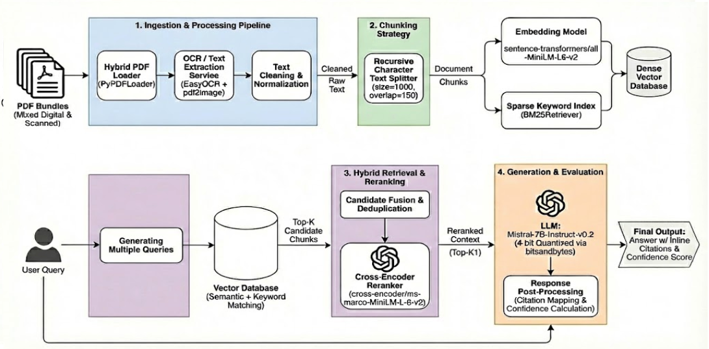
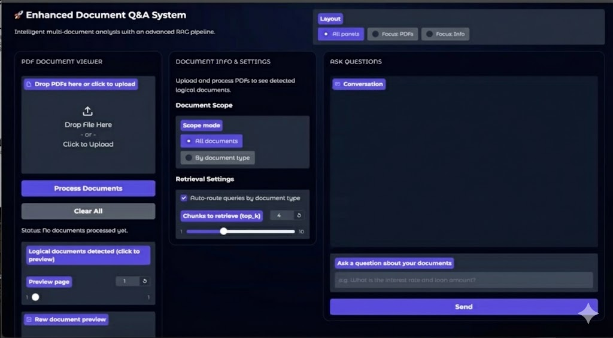

# AI-Powered Document Insights and Data Extraction

## Project Overview

Mortgage and loan operations teams routinely work with large, mixed “loan packs” that bundle contracts, payslips, resumes, and lender fee worksheets into 100+ page PDF blobs. Manually scanning these documents to answer questions like “What is the borrower’s net pay?” or “What are the total lender fees?” is slow, error-prone, and hard to scale—especially when scans, low-quality OCR, and varied layouts break naive text extraction.

This project builds a document-aware Retrieval-Augmented Generation (RAG) pipeline that turns such mortgage and employment PDF bundles into a searchable knowledge layer. Using OCR, logical segmentation, hybrid retrieval, and a local Mistral-7B model, the system powers a chat-style assistant that answers questions with citations, confidence scores, and offline evaluation metrics.

---

## Executive Summary

The repository contains an end-to-end prototype of a mortgage document intelligence assistant:

- Ingests a small corpus of 7 logical documents (20 pages) spanning contracts, detailed and simple payslips, a lender fee worksheet, and a functional resume.
- Uses PyMuPDF and PaddleOCR to robustly extract text from both digital and scanned PDFs.
- Builds a hybrid retriever (dense MiniLM embeddings + BM25 + cross-encoder reranker) over chunked text with rich metadata (document type, file name, page range).
- Serves answers through a Gradio web UI with:
  - PDF upload and processing  
  - Logical document list and page preview  
  - OCR text preview  
  - Document-scope controls (all documents vs. by document type)  
  - A chat panel with answers, sources, and live latency metrics
- Evaluates performance on a curated 38-question benchmark with a scripted offline harness that measures field accuracy, numeric error, retrieval quality, and latency.

Key outcomes:

### Retrieval Quality

- Recall@5: 100 percent (every query had at least one correct chunk in the top 5)
- Mean Reciprocal Rank (MRR): 1.00 (correct chunk ranked first for all queries)

### Answer Quality

- Overall field-level exact match: 65.8 percent (25 out of 38 Q and A pairs)
- No clear hallucinations; errors mainly come from parsing / formatting or partial retrieval rather than invented facts (based on manual review)

### Latency and Robustness

- Average response time: approximately 1.9 seconds
- Median response time: approximately 2.0 seconds per question on the test set
- Error rate: 0 percent (no empty or crashed responses)

The slide deck in this repository summarizes the problem, architecture, and impact, while the demo video walks through the Gradio interface and typical mortgage question and answer workflows.

---

## Insights Deep-Dive

### Overview

#### Corpus and Document Coverage

The prototype focuses on a realistic, but controlled, mortgage pack:

- 7 logical documents / 20 total pages, auto-detected from uploaded PDFs:
  - 2 employment / services contracts  
  - 3 payslips (detailed and simple)  
  - 1 lender fee worksheet  
  - 1 functional resume  

All documents in the current test set are digital, but the OCR stack is designed to handle scanned or mixed documents as well.

This mix covers common tasks for loan operations teams:

- Verifying employment terms and conditions
- Checking regular and year-to-date net pay
- Validating lender and borrower fee structures
- Extracting resume details for underwriting or background checks

---

## RAG Pipeline Architecture

The multi-modal RAG pipeline has the following core components.

### OCR and Parsing

- PyMuPDF (fitz) for PDF page rendering and text extraction
- PaddleOCR as a fallback for pages with too little embedded text (for example, scans or image-heavy layouts)
- Heuristics to classify pages as digital vs. scanned and to aggregate pages into logical documents

### Chunking and Embeddings

- LlamaIndex sentence splitter / recursive chunker to create semantic chunks of approximately 500–512 characters with about 100 characters of overlap
- HuggingFace MiniLM (all-MiniLM-L6-v2) to create 384-dimensional, L2-normalized sentence embeddings

### Hybrid Retrieval

- Dense vector search via LlamaIndex VectorStoreIndex (in-memory)
- Sparse retrieval via BM25Okapi over raw chunk text
- Cross-encoder reranker to score and reorder the top candidate chunks before they are passed to the language model

### LLM and Prompting

- Mistral-7B-Instruct-v0.2 (GGUF) served locally via LlamaCPP
  - 4-bit quantized model
  - 4096 token context window
- Domain-specific prompts instruct the model to:
  - Answer only from retrieved context
  - Extract numeric values carefully and preserve formats
  - Cite supporting chunks and avoid speculation

### Metadata-Aware Routing

- Every chunk is tagged with:
  - doc_id  
  - doc_type (contract, pay_slip, lender_fee_sheet, resume)  
  - file_name  
  - page_range
- Queries can be:
  - Auto-routed by document type, based on simple intent classification
  - Manually scoped by the user via document-type filters in the UI

---

## Retrieval and Answer Quality

### Evaluation Setup

A custom evaluation harness runs 38 curated question and answer examples that cover:

- Contract fields:
  - Probation period
  - Termination clauses
  - Working hours
  - Rest periods and breaks
- Payslip fields:
  - Net pay
  - Total earnings and total deductions
  - Working days
  - Year-to-date net pay
  - Employee IDs and other identifiers
- Lender fee sheet fields:
  - Loan amount
  - Interest rate
  - Specific lender and borrower fees
- Resume details:
  - Candidate name
  - Education and GPA
  - Most recent job title and employer

For each question, the harness:

- Calls the RAG pipeline once
- Logs retrieval sources, confidence scores, and timings
- Computes:
  - Recall@5 and MRR (whether the correct file or region is among the top k chunks and how high it ranks)
  - Field-level correctness (all required keywords present in the answer)
  - Numeric relative error (for numeric answers)
  - ROUGE-style F1 overlap between expected and generated answers
  - Latency and error flags

### Overall Metrics

From the full benchmark run:

- Field Accuracy (exact match): 65.8 percent
- Numeric Accuracy (average relative error): 0.2610

Retrieval Quality:

- Recall@5: 100.0 percent
- MRR: 1.0000

Readability:

- ROUGE-style F1 overlap: 0.2864

Latency:

- Average: 1.926 seconds
- Median: 2.048 seconds

Error Rate:

- 0.0 percent

This demonstrates a strong retrieval layer (the system consistently finds the correct region) with good but improvable answer extraction and formatting.

### Accuracy by Document Type

Breaking performance down by document type:

- Contracts (N = 17)
  - Field Accuracy: 88.2 percent
  - Numeric Error: 0.2083
- Lender Fee Sheet (N = 4)
  - Field Accuracy: 75.0 percent
  - Numeric Error: 0.0000
- Resume (N = 4)
  - Field Accuracy: 75.0 percent
  - Numeric Error: 0.0000
- Payslips (N = 13)
  - Field Accuracy: 30.8 percent
  - Numeric Error: 0.4003

The system is highly reliable on structured contracts, fee sheets, and resume data but struggles more with dense, tabular payslips where many similar numeric fields appear side-by-side (gross vs. net pay, multiple rows of earnings and deductions, and similar line items).

---

## System Performance and User Experience

### Latency and Throughput

- Scripted evaluation shows roughly 2 seconds per end-to-end query, including both retrieval and generation.
- Within the Gradio app, each chat turn logs:
  - Total response time
  - Retrieval latency
  - LLM generation time
  - Rolling average response time and approximate per-chunk retrieval cost across the session

This makes performance transparent to both developers and demo users.

### Gradio UI Flow

The interactive app guides users through three main panels.

#### Left Panel – Documents

- Upload one or more PDF files
- View a list of detected logical documents, with document type and ID
- Use a page slider to render a page preview image
- View the OCR text corresponding to the current page

#### Middle Panel – Scope and Settings

- See document metadata summary:
  - Document types
  - Counts
  - Page totals
- Choose a Scope Mode:
  - All documents
  - By document type, with checkboxes for:
    - contract  
    - pay_slip  
    - lender_fee_sheet  
    - resume
- Configure retrieval parameters:
  - Toggle auto-routing of queries by document type
  - Control top_k, the number of chunks retrieved

#### Right Panel – Chat Assistant

- Ask free-form questions such as:
  - “What is the probationary period in the employment contract?”
  - “What is the borrower’s net monthly pay on the latest payslip?”
- Receive:
  - A natural-language answer
  - Cited source snippets with file names and page numbers
  - A metrics summary (last response time, retrieval and LLM timings)

Together, these elements provide an auditable, explainable mortgage document copilot rather than a black-box chatbot.

---

## Limitations and Learnings

Current limitations and observed failure modes include:

### Input and Document Processing

- OCR quality can drop on low-resolution scans and dense tables.
- Heuristic logical-document detection and document-type tagging can mislabel edge cases or unusual formats.

### Answer Quality and Retrieval Gaps

- The system struggles with multi-document or multi-month questions, especially where repetitive patterns exist across payslips.
- Numeric extraction sometimes confuses adjacent fields, such as gross vs. net pay or multiple fee lines on the same sheet.

### Scalability and Robustness

- Uses an in-memory vector index rebuilt per session (no persistent vector database).
- Relies on a single local 7B model instance, which limits concurrent throughput.

Despite these limitations, the project demonstrates that a carefully tuned open-source RAG stack can achieve strong retrieval performance and usable accuracy on realistic financial documents with low latency and zero per-token cloud cost.

---

## Recommendations

Building on the current prototype, the following next steps are recommended.

### Tighten Numeric Extraction

- Add regex-based validators and range checks for key numeric fields such as net pay, loan amount, and fees.
- Normalize currency and number formats before comparison and display.

### Expand and Systematize Evaluation

- Add more labeled question and answer examples across new document types and edge cases.
- Use error analysis to refine prompts, chunking strategies, and document-type routing rules.

### Improve Payslip Handling

- Introduce layout-aware parsing templates for common payslip formats.
- Use per-doctype extraction prompts (for example, dedicated prompts for payslips versus fee sheets) to reduce confusion between similar numeric fields.

### Productionize the Retrieval Layer

- Move from an in-memory index to a persistent vector database such as Chroma or another vector store.
- Add background indexing jobs for large corpora or frequently updated document sets.

### Operational Hardening

- Wrap the RAG pipeline inside an API service.
- Add monitoring, logging, and continuous evaluation to track accuracy and latency in real-world usage.

---

## Notebook and Demo Instructions

To run the RAG pipeline and Gradio demo locally or in Google Colab:

### 1. Open the Notebook

- Locate the Jupyter or Colab notebook in this repository, for example:
  - `outamation_final_ragpipeline_assignment_enhancement.ipynb`
- Open it in Google Colab or in a local Jupyter environment.

### 2. Install Dependencies

Run the initial setup cells to install the required packages, including:

- `numpy<2.0`
- `rank-bm25`
- `sentence-transformers`
- `gradio`
- `pymupdf`
- `paddleocr`
- Any other dependencies listed in the notebook

Ensure that the Mistral GGUF model path (`MODEL_PATH`) points to a valid local file.

### 3. Instantiate the RAG Pipeline

Execute the cells that:

- Create the LlamaCPP LLM instance (Mistral-7B-Instruct-v0.2 GGUF)
- Configure the MiniLM embedding model
- Define and instantiate the `RAGPipeline` class

### 4. Upload and Process PDFs

- Use the provided upload widget in the notebook (or pass local file paths) to load mortgage PDF files.
- Run the ingest and index cell to:
  - Extract and OCR text
  - Build logical documents
  - Construct the hybrid retrieval index
  - Print ingest and indexing summaries

### 5. Launch the Gradio App

Run the Gradio UI cell. In the launched interface:

- Upload PDFs if needed
- Inspect document previews and OCR text
- Configure scope and retrieval settings
- Chat with the assistant and observe answers and performance metrics

### 6. Run the Offline Evaluation (Optional)

Execute the evaluation cells to:

- Build the 38-question test set
- Run the full benchmark
- Print overall metrics and metrics broken down by document type

### 7. Watch the Demo Video (Optional)

Open the included demo video file in this repository to see a narrated walkthrough of:

- The Gradio UI
- Example questions and answers
- How the system surfaces sources and performance metrics

---

## Technologies Used

- Python  
- Google Colab / Jupyter Notebook  

Document processing:

- PyMuPDF (fitz) for PDF parsing and page rendering
- PaddleOCR for OCR on scanned or low-text pages

RAG stack:

- LlamaIndex for document and chunk management and vector indexing
- HuggingFace MiniLM (all-MiniLM-L6-v2) embeddings
- `rank-bm25` for lexical BM25 retrieval
- `sentence-transformers` CrossEncoder for reranking

LLM inference:

- Mistral-7B-Instruct-v0.2 GGUF
- LlamaCPP for local, quantized inference with a 4-bit model

UI and evaluation:

- Gradio for web-based user interface
- Custom Python evaluation harness for retrieval and accuracy metrics

---

## Acknowledgement

This project was developed as part of an AI externship focused on mortgage document intelligence. It builds on assignment materials, evaluation guidelines, and feedback from mentors and reviewers who helped shape the architecture, evaluation design, and final demo.
